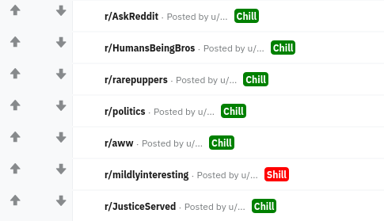
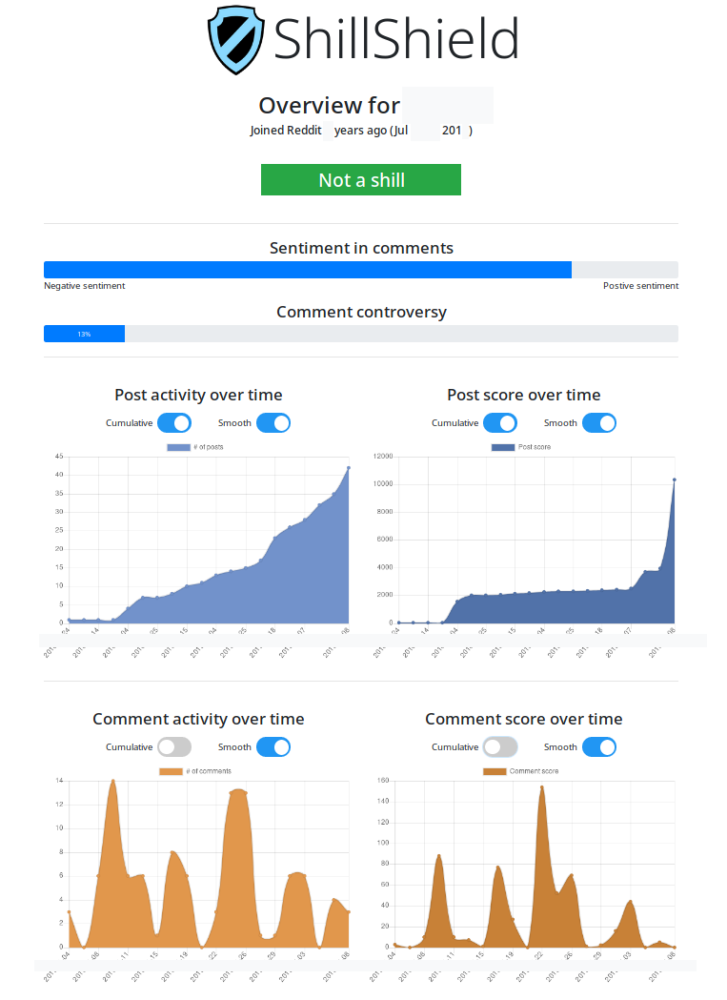

# ShillShield

Browser extension for automatic detection of shill accounts on [Reddit](https://www.reddit.com/).

## Showcase

ShillShield displays badges to show if the user is a shill or not.

_Images edited to preserve users' anonymity._

Upon clicking a badge, detailed information about the user is shown.

User analysis is done in the background by the extension, with no external communication other than Reddit API access.

Analyzed features include posting patterns, post content (spam and sentiment) and others.

## How to install
1. Update your repo.
2. Install `sentiment` and `browserify` through `npm`.
3. Run `make` in the repo directory.
4. Open new tab in Firefox and type in `about:debugging`.
5. Click 'Load Temporary Add-on...' and open any file in the 'extension' directory of the repo.
6. The extension will be removed on browser restart or by clicking on 'Remove'.
7. Click on 'Reload' to reload the extension if any changes have been made. Also make sure to rebuild using `make`.

## How to debug
1. Install the extension as described above.
2. Tick 'Enable add-on debugging'.
3. Click on 'Debug'.
4. Click OK on the pop-up.
5. The new window will show you the console for the background script.
